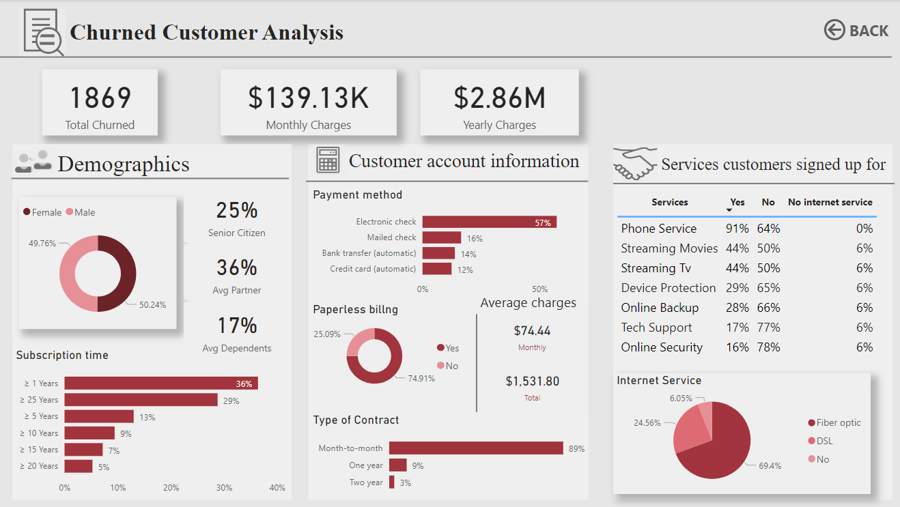
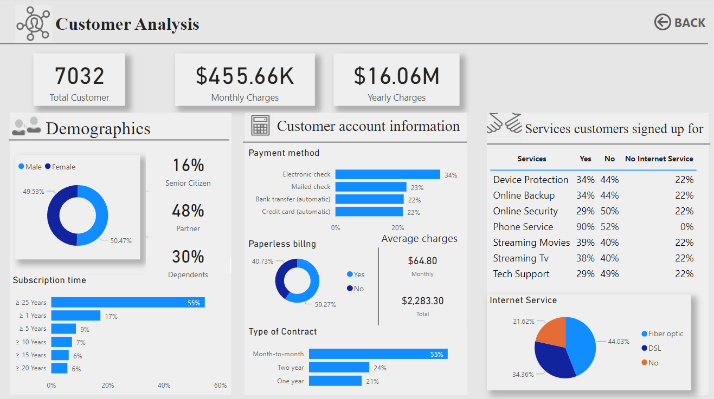
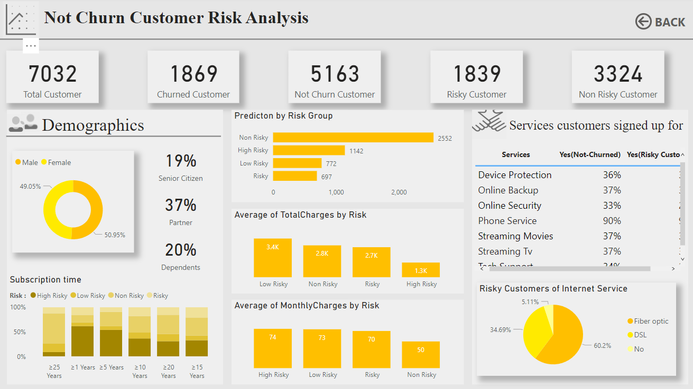

# Customer Churn Prediction and Risk Analysis

Customer churn is a critical challenge in the telecom industry, directly impacting revenue and long-term growth.  
This project leverages **Power BI dashboards** and **machine learning models** to analyze churn behavior, identify customer risk factors, and provide actionable insights for improving retention strategies.

---

## 🔹 Tech Stack & Skills
- **Languages/Tools**: Python, Pandas, NumPy, Scikit-learn, Power BI
- **Techniques**: Data Preprocessing, Feature Engineering, Oversampling (SMOTE), Hyperparameter Tuning
- **Visualization**: Interactive Power BI Dashboards
- **Machine Learning Models**: Logistic Regression, Random Forest, KNN, XGBoost

---

## 📊 Report Sections

### 1. **Churned Customer Analysis**
- Identified **1869 churned customers** (~27% of total), contributing ~$2.86M yearly revenue loss.
- **Key drivers of churn**:
  - 89% of churned customers were on **Month-to-Month contracts**.
  - 57% paid via **Electronic Check** (highest churn risk).
  - **69% of churned customers used Fiber Optic service**, highlighting dissatisfaction.
  - Customers with fewer add-on services (e.g., Tech Support, Online Security, Device Protection) showed higher churn likelihood.

---

### 2. **Customer Overall Analysis**
- Total customer base: **7032**, generating ~$16.06M yearly revenue.
- Customers with **long tenure (>25 years)** and **long-term contracts (1–2 years)** show higher retention.
- **Value-added services** (Online Security, Backup, Device Protection) are linked with **lower churn risk**.
- Average **monthly charges**: $64.80 for retained customers vs. $74.44 for churned customers.

---

### 3. **Not Churn Customer Risk Analysis**
- Segmented retained customers into risk categories:  
  - **Non-Risky**: 2552  
  - **Low Risk**: 772  
  - **Risky**: 697  
  - **High Risk**: 1142  
- **High-risk customers** have the **lowest monthly charges ($50)**, compared to ~$73–74 for non-risky groups.
- **60% of risky customers use Fiber Optic**, reinforcing dissatisfaction patterns.
- Machine learning prediction achieved an **F1-score of 0.83** (17% improvement after oversampling + tuning).

---

### 4. **Q & A (Interactive Exploration)**
- Integrated **Power BI Q&A** feature for stakeholders to explore insights directly.  
  Example queries:  
  - *“Which contract type has the highest churn?”*  
  - *“What is the churn rate among senior citizens?”*

---

## 📷 Screenshots

**Churned Customer Analysis Dashboard**  

**Customer Overview Dashboard**  

**Risk Prediction Dashboard**  

---

## 🔑 Key Insights & Business Recommendations

- **Contract Flexibility Drives Churn**  
  - Month-to-Month contracts strongly correlate with churn.  
  - 🔹 *Recommendation*: Offer discounts/incentives for switching to annual or biennial contracts.

- **Payment Method Matters**  
  - Electronic Check users have the highest churn.  
  - 🔹 *Recommendation*: Promote automatic/credit card payments with loyalty rewards.

- **Fiber Optic Dissatisfaction**  
  - Majority of churned and risky customers use Fiber Optic.  
  - 🔹 *Recommendation*: Investigate service quality and customer support for Fiber users.

- **Value-Added Services Improve Retention**  
  - Customers with Tech Support, Security, or Device Protection churn less.  
  - 🔹 *Recommendation*: Bundle these services with internet plans at discounted rates.

- **Early Tenure is Risky**  
  - Most churn occurs within the **first year of subscription**.  
  - 🔹 *Recommendation*: Implement strong onboarding, early engagement, and loyalty programs.

---

## 📌 Project Link
For more details, visit the full project on GitHub:  
👉 [Customer Churn Prediction and Risk Analysis](https://github.com/PrepStation201/Customer-Churn-Prediction-and-Risk-Analytics-using-Power-BI)
